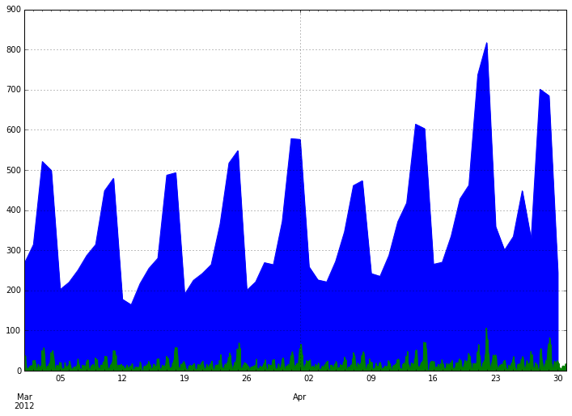
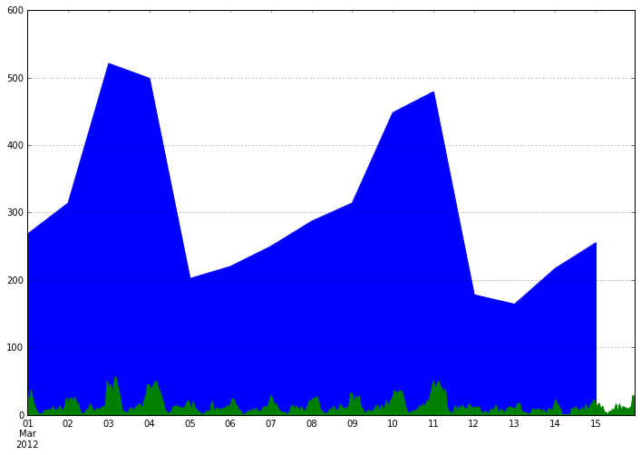
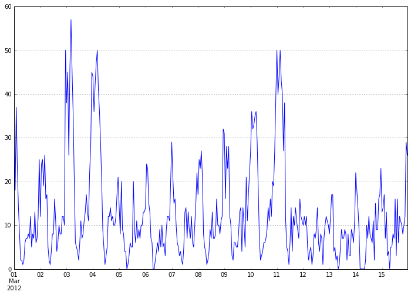
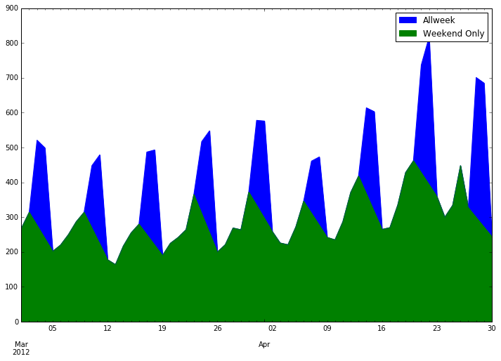
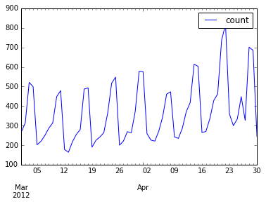
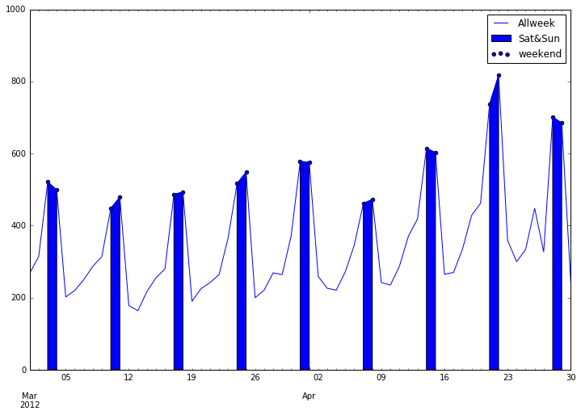
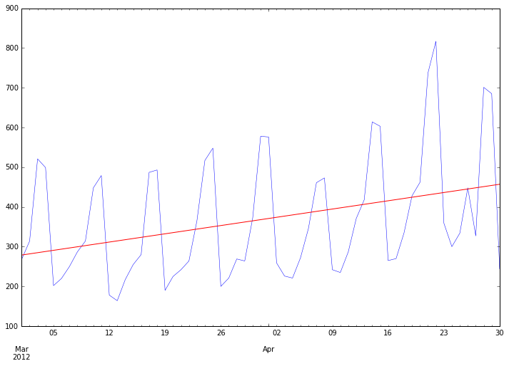

# Hitch Demand Prediction
#### 1.  This project is done in Python 2.7.  I'll use a dataset of Hitch client logins and attemp to predict future demand based on historical data. Models that will be used include:
* statsmodels
* Scipy.stats


```python
import pandas as pd
import numpy as np
import statsmodels.api as sm
from scipy import stats
import matplotlib.pyplot as plt
print pd.__version__
%matplotlib inline
```

    0.19.1


```python
# First, load the data.
ts = pd.read_json('data/logins.json',typ='series')
print ts.shape
ts.head()
```

    (22447,)


    0   2012-03-01 00:05:55
    1   2012-03-01 00:06:23
    2   2012-03-01 00:06:52
    3   2012-03-01 00:11:23
    4   2012-03-01 00:12:47
    dtype: datetime64[ns]


#### 2. The indices is the timestamps. The values created should be a series of ones so that we can count them. I convert the data frame so that it looks like this (where the left column is the index):


```python
ts = pd.Series(1,ts)
```


```python
ts.head()
```


    2012-03-01 00:05:55    1
    2012-03-01 00:06:23    1
    2012-03-01 00:06:52    1
    2012-03-01 00:11:23    1
    2012-03-01 00:12:47    1
    dtype: int64


```python
ts_day = ts.resample(rule = 'D').count() #group by day
ts_day.tail()
```


    2012-04-26    448
    2012-04-27    327
    2012-04-28    701
    2012-04-29    685
    2012-04-30    244
    Freq: D, dtype: int64


```python
ts_hour = ts.resample(rule = 'H').count()
ts_hour.head()
```


    2012-03-01 00:00:00    31
    2012-03-01 01:00:00    18
    2012-03-01 02:00:00    37
    2012-03-01 03:00:00    23
    2012-03-01 04:00:00    14
    Freq: H, dtype: int64


```python
ts_day.plot(figsize = (12,8),kind = 'area');
ts_hour.plot(kind = 'area', grid=True, figsize = (12,8));
```





```python
# Zoom in by slicing the index
ts_day['2012-03-01':'2012-03-15'].plot(figsize = (12,8),kind = 'area');
ts_hour['2012-03-01':'2012-03-15'].plot(kind = 'area', grid=True, figsize = (12,8));
```





```python
ts_hour['2012-03-01':'2012-03-15'].plot(kind = 'line', grid=True, figsize = (12,8));
```





#### Create a dataframe that has count and dayofweek features. 


```python
df = pd.DataFrame(ts_day)
df.rename(columns = {0:'count'}, inplace=True)
df.head()
```


<div>
<table border="1" class="dataframe">
  <thead>
    <tr style="text-align: right;">
      <th></th>
      <th>count</th>
    </tr>
  </thead>
  <tbody>
    <tr>
      <th>2012-03-01</th>
      <td>268</td>
    </tr>
    <tr>
      <th>2012-03-02</th>
      <td>314</td>
    </tr>
    <tr>
      <th>2012-03-03</th>
      <td>521</td>
    </tr>
    <tr>
      <th>2012-03-04</th>
      <td>499</td>
    </tr>
    <tr>
      <th>2012-03-05</th>
      <td>202</td>
    </tr>
  </tbody>
</table>
</div>


```python
df['weekofday'] = pd.DatetimeIndex(df.index).weekday
# Or use the following
#df['weekofday'] = pd.to_datetime(df.index).weekday
```


```python
df['weekend'] = df['weekofday']>=5
df.head()
```


<div>
<table border="1" class="dataframe">
  <thead>
    <tr style="text-align: right;">
      <th></th>
      <th>count</th>
      <th>weekofday</th>
      <th>weekend</th>
    </tr>
  </thead>
  <tbody>
    <tr>
      <th>2012-03-01</th>
      <td>268</td>
      <td>3</td>
      <td>False</td>
    </tr>
    <tr>
      <th>2012-03-02</th>
      <td>314</td>
      <td>4</td>
      <td>False</td>
    </tr>
    <tr>
      <th>2012-03-03</th>
      <td>521</td>
      <td>5</td>
      <td>True</td>
    </tr>
    <tr>
      <th>2012-03-04</th>
      <td>499</td>
      <td>6</td>
      <td>True</td>
    </tr>
    <tr>
      <th>2012-03-05</th>
      <td>202</td>
      <td>0</td>
      <td>False</td>
    </tr>
  </tbody>
</table>
</div>


```python
#filter or masking
df[df['weekofday']>=5]['count'].sum()
```


    10237


```python
df[df['weekofday']<5]['count'].sum()
```


    12210


```python
df['count'].plot(figsize=(12,8),kind = 'area', label = 'Allweek')
df[df['weekofday']<5]['count'].plot(kind='area',label = 'Weekend Only')
plt.legend();
```





```python
df.plot(df.index, y = 'count')
plt.legend();
```





#### Show strong seasonal component to the data. I'd be willing to bet that the peaks are weekend demand. Let's see if that's true by highlighting the weekends on our plot with fill_between weekend.


```python
df['count'].plot(figsize=(12,8),kind = 'line', label = 'Allweek')
plt.fill_between(df.index, df['count'], where = df['weekend'], label = 'Sat&Sun')
df1 = df[df['weekofday']>=5]
plt.scatter(x = df1.index, y = df1['count'], label = 'weekend')
# df1['count'].plot(kind = 'area')
plt.ylim(0,1000)
plt.legend();
```





### Box-Jenkins Methodology

* determine if the data is stationary
* Plot the ACF/PACF with 28 lags (Approx. 4 weeks -- See snippet of code below)


```python
y = ts_day.values
X = range(1, ts_day.shape[0]+1)
model = sm.OLS(y, sm.add_constant(X)).fit()
```


```python
ts_day.plot(figsize=(12,8), lw=0.5)
pd.Series(model.fittedvalues, index=ts_day.index).plot(style='r')
```


    <matplotlib.axes._subplots.AxesSubplot at 0x11b16dd10>




