```python
import pandas as pd
import numpy as np
import statsmodels.api as sm
from scipy import stats
import matplotlib.pyplot as plt

%matplotlib inline
```


```python
df = pd.read_csv('data/birth.txt')
df.head()
```


<div>
<table border="1" class="dataframe">
  <thead>
    <tr style="text-align: right;">
      <th></th>
      <th>num_births</th>
    </tr>
  </thead>
  <tbody>
    <tr>
      <th>0</th>
      <td>295</td>
    </tr>
    <tr>
      <th>1</th>
      <td>286</td>
    </tr>
    <tr>
      <th>2</th>
      <td>300</td>
    </tr>
    <tr>
      <th>3</th>
      <td>278</td>
    </tr>
    <tr>
      <th>4</th>
      <td>272</td>
    </tr>
  </tbody>
</table>
</div>


```python
print df.shape[0]/31 #31 years
print df.shape
```

    12
    (372, 1)


```python
df['dates']=pd.date_range("1980-01-01", "2010-12-31", freq="1M")
```


```python
df.head()
```


<div>
<table border="1" class="dataframe">
  <thead>
    <tr style="text-align: right;">
      <th></th>
      <th>num_births</th>
      <th>dates</th>
    </tr>
  </thead>
  <tbody>
    <tr>
      <th>0</th>
      <td>295</td>
      <td>1980-01-31</td>
    </tr>
    <tr>
      <th>1</th>
      <td>286</td>
      <td>1980-02-29</td>
    </tr>
    <tr>
      <th>2</th>
      <td>300</td>
      <td>1980-03-31</td>
    </tr>
    <tr>
      <th>3</th>
      <td>278</td>
      <td>1980-04-30</td>
    </tr>
    <tr>
      <th>4</th>
      <td>272</td>
      <td>1980-05-31</td>
    </tr>
  </tbody>
</table>
</div>


def acf_pacf(ts, lags):
    fig = plt.figure(figsize=(12,8))
    ax1 = fig.add_subplot(211)
    fig = sm.graphics.tsa.plot_acf(ts, lags=lags, ax=ax1)
    ax2 = fig.add_subplot(212)
    fig = sm.graphics.tsa.plot_pacf(ts, lags=lags, ax=ax2)


```python
df['time'] = range(372)
```


```python
df['month'] = pd.DatetimeIndex(df.dates).month
df['year'] = pd.DatetimeIndex(df.dates).year
df['quarters'] = pd.DatetimeIndex(df['dates']).quarter
```


```python
df.head()
```


<div>
<table border="1" class="dataframe">
  <thead>
    <tr style="text-align: right;">
      <th></th>
      <th>num_births</th>
      <th>dates</th>
      <th>time</th>
      <th>month</th>
      <th>year</th>
      <th>quarters</th>
    </tr>
  </thead>
  <tbody>
    <tr>
      <th>0</th>
      <td>295</td>
      <td>1980-01-31</td>
      <td>0</td>
      <td>1</td>
      <td>1980</td>
      <td>1</td>
    </tr>
    <tr>
      <th>1</th>
      <td>286</td>
      <td>1980-02-29</td>
      <td>1</td>
      <td>2</td>
      <td>1980</td>
      <td>1</td>
    </tr>
    <tr>
      <th>2</th>
      <td>300</td>
      <td>1980-03-31</td>
      <td>2</td>
      <td>3</td>
      <td>1980</td>
      <td>1</td>
    </tr>
    <tr>
      <th>3</th>
      <td>278</td>
      <td>1980-04-30</td>
      <td>3</td>
      <td>4</td>
      <td>1980</td>
      <td>2</td>
    </tr>
    <tr>
      <th>4</th>
      <td>272</td>
      <td>1980-05-31</td>
      <td>4</td>
      <td>5</td>
      <td>1980</td>
      <td>2</td>
    </tr>
  </tbody>
</table>
</div>


```python
df = df.set_index('dates')
```


```python
df.head()
```


<div>
<table border="1" class="dataframe">
  <thead>
    <tr style="text-align: right;">
      <th></th>
      <th>num_births</th>
      <th>time</th>
      <th>month</th>
      <th>year</th>
      <th>quarters</th>
    </tr>
    <tr>
      <th>dates</th>
      <th></th>
      <th></th>
      <th></th>
      <th></th>
      <th></th>
    </tr>
  </thead>
  <tbody>
    <tr>
      <th>1980-01-31</th>
      <td>295</td>
      <td>0</td>
      <td>1</td>
      <td>1980</td>
      <td>1</td>
    </tr>
    <tr>
      <th>1980-02-29</th>
      <td>286</td>
      <td>1</td>
      <td>2</td>
      <td>1980</td>
      <td>1</td>
    </tr>
    <tr>
      <th>1980-03-31</th>
      <td>300</td>
      <td>2</td>
      <td>3</td>
      <td>1980</td>
      <td>1</td>
    </tr>
    <tr>
      <th>1980-04-30</th>
      <td>278</td>
      <td>3</td>
      <td>4</td>
      <td>1980</td>
      <td>2</td>
    </tr>
    <tr>
      <th>1980-05-31</th>
      <td>272</td>
      <td>4</td>
      <td>5</td>
      <td>1980</td>
      <td>2</td>
    </tr>
  </tbody>
</table>
</div>


```python
df.info()
```

    <class 'pandas.core.frame.DataFrame'>
    DatetimeIndex: 372 entries, 1980-01-31 to 2010-12-31
    Data columns (total 5 columns):
    num_births    372 non-null int64
    time          372 non-null int64
    month         372 non-null int32
    year          372 non-null int32
    quarters      372 non-null int32
    dtypes: int32(3), int64(2)
    memory usage: 13.1 KB


```python
sdf = df.groupby('month')['num_births'].mean()
print sdf.max()
print np.argmax(sdf)
```

    334.161290323
    8


```python
df_month = df.groupby('month').sum()
```


```python
df_month.head(12)
```


<div>
<table border="1" class="dataframe">
  <thead>
    <tr style="text-align: right;">
      <th></th>
      <th>num_births</th>
      <th>time</th>
      <th>year</th>
      <th>quarters</th>
    </tr>
    <tr>
      <th>month</th>
      <th></th>
      <th></th>
      <th></th>
      <th></th>
    </tr>
  </thead>
  <tbody>
    <tr>
      <th>1</th>
      <td>9493</td>
      <td>5580</td>
      <td>61845</td>
      <td>31</td>
    </tr>
    <tr>
      <th>2</th>
      <td>8942</td>
      <td>5611</td>
      <td>61845</td>
      <td>31</td>
    </tr>
    <tr>
      <th>3</th>
      <td>9577</td>
      <td>5642</td>
      <td>61845</td>
      <td>31</td>
    </tr>
    <tr>
      <th>4</th>
      <td>9008</td>
      <td>5673</td>
      <td>61845</td>
      <td>62</td>
    </tr>
    <tr>
      <th>5</th>
      <td>9315</td>
      <td>5704</td>
      <td>61845</td>
      <td>62</td>
    </tr>
    <tr>
      <th>6</th>
      <td>9428</td>
      <td>5735</td>
      <td>61845</td>
      <td>62</td>
    </tr>
    <tr>
      <th>7</th>
      <td>10164</td>
      <td>5766</td>
      <td>61845</td>
      <td>93</td>
    </tr>
    <tr>
      <th>8</th>
      <td>10359</td>
      <td>5797</td>
      <td>61845</td>
      <td>93</td>
    </tr>
    <tr>
      <th>9</th>
      <td>10231</td>
      <td>5828</td>
      <td>61845</td>
      <td>93</td>
    </tr>
    <tr>
      <th>10</th>
      <td>10008</td>
      <td>5859</td>
      <td>61845</td>
      <td>124</td>
    </tr>
    <tr>
      <th>11</th>
      <td>9475</td>
      <td>5890</td>
      <td>61845</td>
      <td>124</td>
    </tr>
    <tr>
      <th>12</th>
      <td>9719</td>
      <td>5921</td>
      <td>61845</td>
      <td>124</td>
    </tr>
  </tbody>
</table>
</div>


```python
df_month['num_births'].plot(kind = 'line')
```


    <matplotlib.axes._subplots.AxesSubplot at 0x117550790>


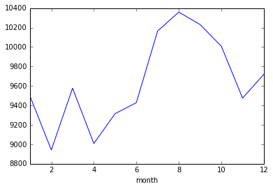


```python
df_month['num_births'].plot(kind = 'area')
```


    <matplotlib.axes._subplots.AxesSubplot at 0x119ad1910>


```python
df_month['num_births'].plot(kind = 'bar')
```


    <matplotlib.axes._subplots.AxesSubplot at 0x119b01390>


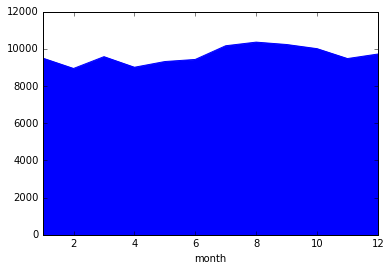


```python
ax = plt.scatter(x = df_month.index, y =df_month.num_births)
```


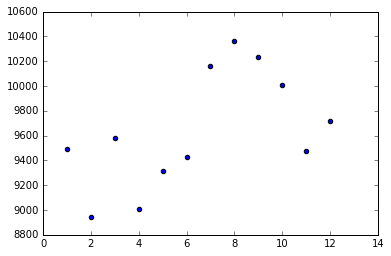


```python
df_month
```


<div>
<table border="1" class="dataframe">
  <thead>
    <tr style="text-align: right;">
      <th></th>
      <th>num_births</th>
      <th>time</th>
      <th>year</th>
      <th>quarters</th>
    </tr>
    <tr>
      <th>month</th>
      <th></th>
      <th></th>
      <th></th>
      <th></th>
    </tr>
  </thead>
  <tbody>
    <tr>
      <th>1</th>
      <td>9493</td>
      <td>5580</td>
      <td>61845</td>
      <td>31</td>
    </tr>
    <tr>
      <th>2</th>
      <td>8942</td>
      <td>5611</td>
      <td>61845</td>
      <td>31</td>
    </tr>
    <tr>
      <th>3</th>
      <td>9577</td>
      <td>5642</td>
      <td>61845</td>
      <td>31</td>
    </tr>
    <tr>
      <th>4</th>
      <td>9008</td>
      <td>5673</td>
      <td>61845</td>
      <td>62</td>
    </tr>
    <tr>
      <th>5</th>
      <td>9315</td>
      <td>5704</td>
      <td>61845</td>
      <td>62</td>
    </tr>
    <tr>
      <th>6</th>
      <td>9428</td>
      <td>5735</td>
      <td>61845</td>
      <td>62</td>
    </tr>
    <tr>
      <th>7</th>
      <td>10164</td>
      <td>5766</td>
      <td>61845</td>
      <td>93</td>
    </tr>
    <tr>
      <th>8</th>
      <td>10359</td>
      <td>5797</td>
      <td>61845</td>
      <td>93</td>
    </tr>
    <tr>
      <th>9</th>
      <td>10231</td>
      <td>5828</td>
      <td>61845</td>
      <td>93</td>
    </tr>
    <tr>
      <th>10</th>
      <td>10008</td>
      <td>5859</td>
      <td>61845</td>
      <td>124</td>
    </tr>
    <tr>
      <th>11</th>
      <td>9475</td>
      <td>5890</td>
      <td>61845</td>
      <td>124</td>
    </tr>
    <tr>
      <th>12</th>
      <td>9719</td>
      <td>5921</td>
      <td>61845</td>
      <td>124</td>
    </tr>
  </tbody>
</table>
</div>


```python
ax = df_month['num_births'].plot('pie', figsize=(10,10),fontsize = 15)
ax.legend(fontsize = 10)
plt.show()
```


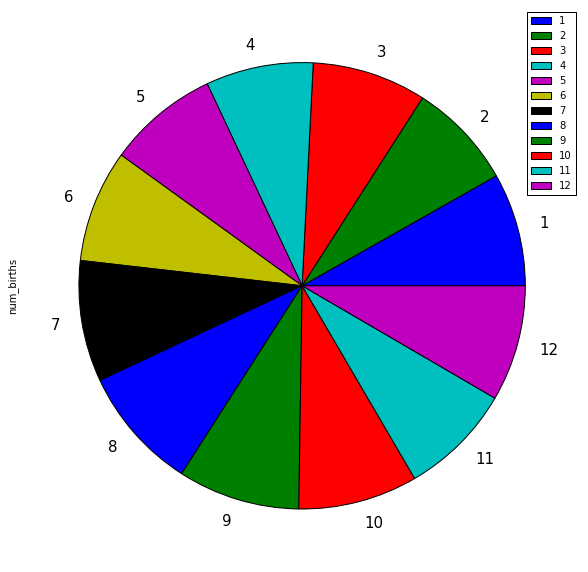


```python
ax = df_month['num_births'].plot('area', figsize=(20,10),fontsize = 15)
ax = df_month['time'].plot('area', figsize=(12,8),fontsize = 15)
ax.set_xlabel('Month', fontsize = 20)
ax.set_ylabel('Count',fontsize = 20)
ax.set_ylim(0,14000)
ax.legend(fontsize = 20)
plt.show()
```


```python
df_month
```


<div>
<table border="1" class="dataframe">
  <thead>
    <tr style="text-align: right;">
      <th></th>
      <th>num_births</th>
      <th>time</th>
      <th>year</th>
      <th>quarters</th>
    </tr>
    <tr>
      <th>month</th>
      <th></th>
      <th></th>
      <th></th>
      <th></th>
    </tr>
  </thead>
  <tbody>
    <tr>
      <th>1</th>
      <td>9493</td>
      <td>5580</td>
      <td>61845</td>
      <td>31</td>
    </tr>
    <tr>
      <th>2</th>
      <td>8942</td>
      <td>5611</td>
      <td>61845</td>
      <td>31</td>
    </tr>
    <tr>
      <th>3</th>
      <td>9577</td>
      <td>5642</td>
      <td>61845</td>
      <td>31</td>
    </tr>
    <tr>
      <th>4</th>
      <td>9008</td>
      <td>5673</td>
      <td>61845</td>
      <td>62</td>
    </tr>
    <tr>
      <th>5</th>
      <td>9315</td>
      <td>5704</td>
      <td>61845</td>
      <td>62</td>
    </tr>
    <tr>
      <th>6</th>
      <td>9428</td>
      <td>5735</td>
      <td>61845</td>
      <td>62</td>
    </tr>
    <tr>
      <th>7</th>
      <td>10164</td>
      <td>5766</td>
      <td>61845</td>
      <td>93</td>
    </tr>
    <tr>
      <th>8</th>
      <td>10359</td>
      <td>5797</td>
      <td>61845</td>
      <td>93</td>
    </tr>
    <tr>
      <th>9</th>
      <td>10231</td>
      <td>5828</td>
      <td>61845</td>
      <td>93</td>
    </tr>
    <tr>
      <th>10</th>
      <td>10008</td>
      <td>5859</td>
      <td>61845</td>
      <td>124</td>
    </tr>
    <tr>
      <th>11</th>
      <td>9475</td>
      <td>5890</td>
      <td>61845</td>
      <td>124</td>
    </tr>
    <tr>
      <th>12</th>
      <td>9719</td>
      <td>5921</td>
      <td>61845</td>
      <td>124</td>
    </tr>
  </tbody>
</table>
</div>


```python
idx = np.argmax(df_month.num_births)
print idx,df_month.num_births[idx]
df_month.loc[idx].num_births
```

    8 10359


    10359


```python
df_month.idxmax()
```


    num_births     8
    time          12
    year           1
    quarters      10
    dtype: int64


```python
df_month.num_births.idxmax()
```


    8


```python
df_month.num_births[idx]
```


    10359


```python
df_year = df.groupby('year').sum()['num_births']
indx = np.argmax(df_year)
indx
```


    1993


```python
df.groupby('year').mean()['num_births'].idxmax()
```


    1993


```python
birthSeries = pd.Series(df['num_births'])
bs = pd.Series(df['num_births'])
birthSeries.head(2)
```


    dates
    1980-01-31    295
    1980-02-29    286
    Name: num_births, dtype: int64


```python
ax = birthSeries.plot(figsize=(12,8), fontsize = 15,kind='line',grid=True)
ax.set_xlabel('Dates',fontsize = 20)
ax.set_ylabel('Birth Counts', fontsize = 20)
ax.set_title('Birth Plot\n', fontsize = 30)
plt.show()
```


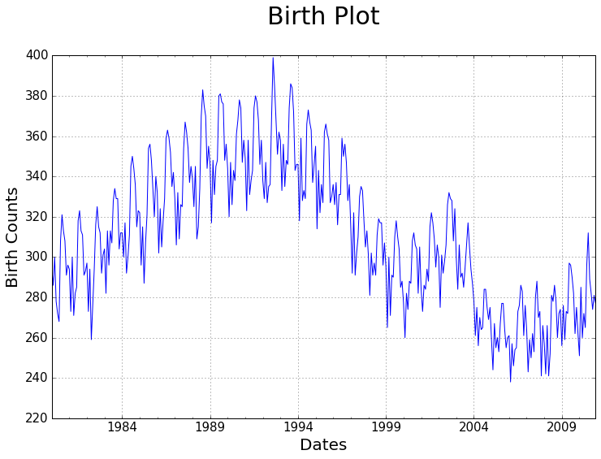


Plot the data for 2006-2010, is the seasonal pattern more apparent?


```python
#birthSeries = pd.Series(df['num_births'])
ax = birthSeries['2008':'2010'].plot(fontsize = 15, title='Birth Plot',figsize=(12,8))
ax.set_xlabel('dates')
ax.set_ylabel('Birth Counts')
plt.show()
```


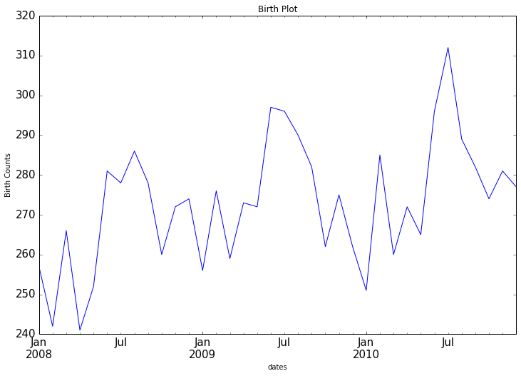


Use df.resample('Q-NOV') to get quarterly means that follow the seasons of the year (spring, summer, fall, winter).


```python
df['num_births'].head()
```


    dates
    1980-01-31    295
    1980-02-29    286
    1980-03-31    300
    1980-04-30    278
    1980-05-31    272
    Name: num_births, dtype: int64


```python
bs.resample('A').mean().head() #year end
```


    dates
    1980-12-31    294.666667
    1981-12-31    296.166667
    1982-12-31    296.166667
    1983-12-31    312.583333
    1984-12-31    320.416667
    Freq: A-DEC, Name: num_births, dtype: float64


```python
bs.resample('Q').mean().head()
```


    dates
    1980-03-31    293.666667
    1980-06-30    272.666667
    1980-09-30    314.000000
    1980-12-31    298.333333
    1981-03-31    289.000000
    Freq: Q-DEC, Name: num_births, dtype: float64


```python
bs.plot(figsize=(12,8), label = 'monthly')
bs.resample('A').mean().plot(label = 'yearly')
bs.resample('Q-NOV').mean().plot(label = 'quarterly')
plt.legend();
```


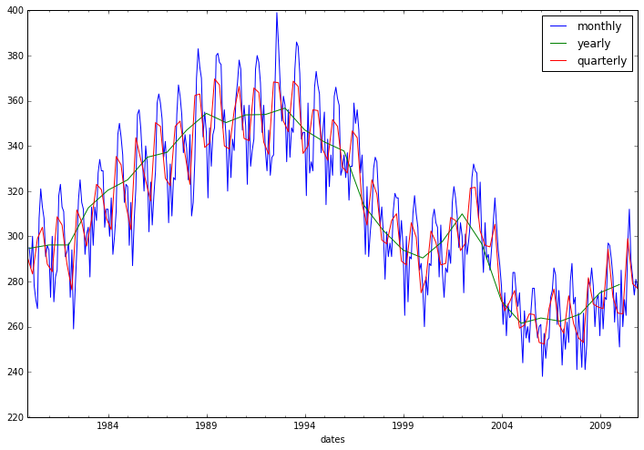


```python
df['time^2'] = df['time']**2
df['time^3'] = df['time']**3
df['time^4'] = df['time']**4
df['time^5'] = df['time']**5
df.head()
```


<div>
<table border="1" class="dataframe">
  <thead>
    <tr style="text-align: right;">
      <th></th>
      <th>num_births</th>
      <th>time</th>
      <th>month</th>
      <th>year</th>
      <th>quarters</th>
      <th>time^2</th>
      <th>time^3</th>
      <th>time^4</th>
      <th>time^5</th>
    </tr>
    <tr>
      <th>dates</th>
      <th></th>
      <th></th>
      <th></th>
      <th></th>
      <th></th>
      <th></th>
      <th></th>
      <th></th>
      <th></th>
    </tr>
  </thead>
  <tbody>
    <tr>
      <th>1980-01-31</th>
      <td>295</td>
      <td>0</td>
      <td>1</td>
      <td>1980</td>
      <td>1</td>
      <td>0</td>
      <td>0</td>
      <td>0</td>
      <td>0</td>
    </tr>
    <tr>
      <th>1980-02-29</th>
      <td>286</td>
      <td>1</td>
      <td>2</td>
      <td>1980</td>
      <td>1</td>
      <td>1</td>
      <td>1</td>
      <td>1</td>
      <td>1</td>
    </tr>
    <tr>
      <th>1980-03-31</th>
      <td>300</td>
      <td>2</td>
      <td>3</td>
      <td>1980</td>
      <td>1</td>
      <td>4</td>
      <td>8</td>
      <td>16</td>
      <td>32</td>
    </tr>
    <tr>
      <th>1980-04-30</th>
      <td>278</td>
      <td>3</td>
      <td>4</td>
      <td>1980</td>
      <td>2</td>
      <td>9</td>
      <td>27</td>
      <td>81</td>
      <td>243</td>
    </tr>
    <tr>
      <th>1980-05-31</th>
      <td>272</td>
      <td>4</td>
      <td>5</td>
      <td>1980</td>
      <td>2</td>
      <td>16</td>
      <td>64</td>
      <td>256</td>
      <td>1024</td>
    </tr>
  </tbody>
</table>
</div>


```python
type(df['num_births'])
```


    pandas.core.series.Series


```python
type(df['num_births'].values)
```


    numpy.ndarray


```python
y = df['num_births'].values
X = df['time'].values
```


```python
model = sm.OLS(y, sm.add_constant(X)).fit()
```


```python
model.params
```


    array([  3.42255081e+02,  -1.68099732e-01])


```python
model.fittedvalues[:10]
```


    array([ 342.25508086,  342.08698113,  341.9188814 ,  341.75078167,
            341.58268193,  341.4145822 ,  341.24648247,  341.07838274,
            340.91028301,  340.74218328])


### If use X = df['time] instead of df['time'].values, then no need to add index = df.index since it's already indexed.


```python
bs.plot(figsize=(12,8))
pd.Series(model.fittedvalues, index = df.index).plot();
# df['time'].plot();
```


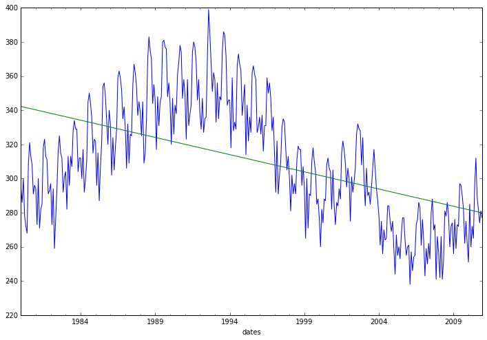


```python
y = df['num_births'].values #no index
X = df['time'] #keep the index
model = sm.OLS(y, sm.add_constant(X)).fit()
bs.plot(figsize=(12,8))
model.fittedvalues.plot(); # still indexed, same as bs
```


```python
model.fittedvalues[:10] #show the index
```


    dates
    1980-01-31    342.255081
    1980-02-29    342.086981
    1980-03-31    341.918881
    1980-04-30    341.750782
    1980-05-31    341.582682
    1980-06-30    341.414582
    1980-07-31    341.246482
    1980-08-31    341.078383
    1980-09-30    340.910283
    1980-10-31    340.742183
    dtype: float64


```python
model.summary()
```


<table class="simpletable">
<caption>OLS Regression Results</caption>
<tr>
  <th>Dep. Variable:</th>            <td>y</td>        <th>  R-squared:         </th> <td>   0.264</td>
</tr>
<tr>
  <th>Model:</th>                   <td>OLS</td>       <th>  Adj. R-squared:    </th> <td>   0.262</td>
</tr>
<tr>
  <th>Method:</th>             <td>Least Squares</td>  <th>  F-statistic:       </th> <td>   133.0</td>
</tr>
<tr>
  <th>Date:</th>             <td>Mon, 23 Jan 2017</td> <th>  Prob (F-statistic):</th> <td>1.72e-26</td>
</tr>
<tr>
  <th>Time:</th>                 <td>22:10:59</td>     <th>  Log-Likelihood:    </th> <td> -1794.5</td>
</tr>
<tr>
  <th>No. Observations:</th>      <td>   372</td>      <th>  AIC:               </th> <td>   3593.</td>
</tr>
<tr>
  <th>Df Residuals:</th>          <td>   370</td>      <th>  BIC:               </th> <td>   3601.</td>
</tr>
<tr>
  <th>Df Model:</th>              <td>     1</td>      <th>                     </th>     <td> </td>   
</tr>
<tr>
  <th>Covariance Type:</th>      <td>nonrobust</td>    <th>                     </th>     <td> </td>   
</tr>
</table>
<table class="simpletable">
<tr>
    <td></td>       <th>coef</th>     <th>std err</th>      <th>t</th>      <th>P>|t|</th> <th>[95.0% Conf. Int.]</th> 
</tr>
<tr>
  <th>const</th> <td>  342.2551</td> <td>    3.125</td> <td>  109.535</td> <td> 0.000</td> <td>  336.111   348.399</td>
</tr>
<tr>
  <th>time</th>  <td>   -0.1681</td> <td>    0.015</td> <td>  -11.531</td> <td> 0.000</td> <td>   -0.197    -0.139</td>
</tr>
</table>
<table class="simpletable">
<tr>
  <th>Omnibus:</th>       <td> 3.968</td> <th>  Durbin-Watson:     </th> <td>   0.316</td>
</tr>
<tr>
  <th>Prob(Omnibus):</th> <td> 0.138</td> <th>  Jarque-Bera (JB):  </th> <td>   3.093</td>
</tr>
<tr>
  <th>Skew:</th>          <td> 0.099</td> <th>  Prob(JB):          </th> <td>   0.213</td>
</tr>
<tr>
  <th>Kurtosis:</th>      <td> 2.600</td> <th>  Cond. No.          </th> <td>    428.</td>
</tr>
</table>


```python
y = df['num_births'].values
X = df[['time', 'time^2']]
model = sm.OLS(y, sm.add_constant(X)).fit()
bs.plot(figsize=(12,8))
model.fittedvalues.plot()
```


    <matplotlib.axes._subplots.AxesSubplot at 0x11b96fd10>


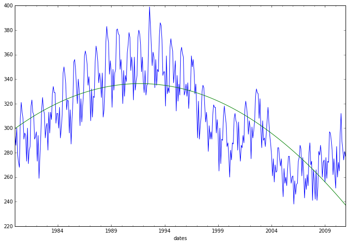


```python
model.summary()
```


<table class="simpletable">
<caption>OLS Regression Results</caption>
<tr>
  <th>Dep. Variable:</th>            <td>y</td>        <th>  R-squared:         </th> <td>   0.564</td>
</tr>
<tr>
  <th>Model:</th>                   <td>OLS</td>       <th>  Adj. R-squared:    </th> <td>   0.562</td>
</tr>
<tr>
  <th>Method:</th>             <td>Least Squares</td>  <th>  F-statistic:       </th> <td>   239.0</td>
</tr>
<tr>
  <th>Date:</th>             <td>Mon, 23 Jan 2017</td> <th>  Prob (F-statistic):</th> <td>2.62e-67</td>
</tr>
<tr>
  <th>Time:</th>                 <td>22:10:59</td>     <th>  Log-Likelihood:    </th> <td> -1697.0</td>
</tr>
<tr>
  <th>No. Observations:</th>      <td>   372</td>      <th>  AIC:               </th> <td>   3400.</td>
</tr>
<tr>
  <th>Df Residuals:</th>          <td>   369</td>      <th>  BIC:               </th> <td>   3412.</td>
</tr>
<tr>
  <th>Df Model:</th>              <td>     2</td>      <th>                     </th>     <td> </td>   
</tr>
<tr>
  <th>Covariance Type:</th>      <td>nonrobust</td>    <th>                     </th>     <td> </td>   
</tr>
</table>
<table class="simpletable">
<tr>
     <td></td>       <th>coef</th>     <th>std err</th>      <th>t</th>      <th>P>|t|</th> <th>[95.0% Conf. Int.]</th> 
</tr>
<tr>
  <th>const</th>  <td>  299.6021</td> <td>    3.600</td> <td>   83.232</td> <td> 0.000</td> <td>  292.524   306.680</td>
</tr>
<tr>
  <th>time</th>   <td>    0.5236</td> <td>    0.045</td> <td>   11.681</td> <td> 0.000</td> <td>    0.435     0.612</td>
</tr>
<tr>
  <th>time^2</th> <td>   -0.0019</td> <td>    0.000</td> <td>  -15.941</td> <td> 0.000</td> <td>   -0.002    -0.002</td>
</tr>
</table>
<table class="simpletable">
<tr>
  <th>Omnibus:</th>       <td> 5.782</td> <th>  Durbin-Watson:     </th> <td>   0.534</td>
</tr>
<tr>
  <th>Prob(Omnibus):</th> <td> 0.056</td> <th>  Jarque-Bera (JB):  </th> <td>   5.168</td>
</tr>
<tr>
  <th>Skew:</th>          <td> 0.222</td> <th>  Prob(JB):          </th> <td>  0.0755</td>
</tr>
<tr>
  <th>Kurtosis:</th>      <td> 2.630</td> <th>  Cond. No.          </th> <td>1.84e+05</td>
</tr>
</table>


```python
X = df[['time', 'time^2', 'time^3']]
model3 = sm.OLS(y, sm.add_constant(X)).fit()
bs.plot(figsize=(12,8))
model3.fittedvalues.plot()
plt.legend();
```


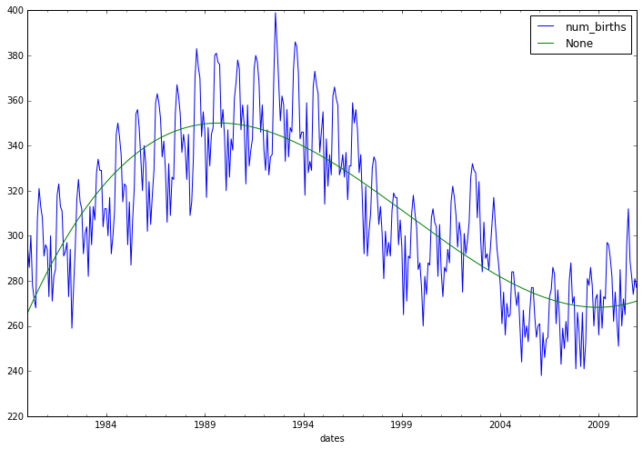


```python
model3.summary()
```


<table class="simpletable">
<caption>OLS Regression Results</caption>
<tr>
  <th>Dep. Variable:</th>            <td>y</td>        <th>  R-squared:         </th> <td>   0.701</td>
</tr>
<tr>
  <th>Model:</th>                   <td>OLS</td>       <th>  Adj. R-squared:    </th> <td>   0.699</td>
</tr>
<tr>
  <th>Method:</th>             <td>Least Squares</td>  <th>  F-statistic:       </th> <td>   287.6</td>
</tr>
<tr>
  <th>Date:</th>             <td>Mon, 23 Jan 2017</td> <th>  Prob (F-statistic):</th> <td>4.31e-96</td>
</tr>
<tr>
  <th>Time:</th>                 <td>22:11:00</td>     <th>  Log-Likelihood:    </th> <td> -1627.0</td>
</tr>
<tr>
  <th>No. Observations:</th>      <td>   372</td>      <th>  AIC:               </th> <td>   3262.</td>
</tr>
<tr>
  <th>Df Residuals:</th>          <td>   368</td>      <th>  BIC:               </th> <td>   3278.</td>
</tr>
<tr>
  <th>Df Model:</th>              <td>     3</td>      <th>                     </th>     <td> </td>   
</tr>
<tr>
  <th>Covariance Type:</th>      <td>nonrobust</td>    <th>                     </th>     <td> </td>   
</tr>
</table>
<table class="simpletable">
<tr>
     <td></td>       <th>coef</th>     <th>std err</th>      <th>t</th>      <th>P>|t|</th> <th>[95.0% Conf. Int.]</th> 
</tr>
<tr>
  <th>const</th>  <td>  265.8165</td> <td>    3.963</td> <td>   67.074</td> <td> 0.000</td> <td>  258.023   273.609</td>
</tr>
<tr>
  <th>time</th>   <td>    1.6238</td> <td>    0.093</td> <td>   17.529</td> <td> 0.000</td> <td>    1.442     1.806</td>
</tr>
<tr>
  <th>time^2</th> <td>   -0.0093</td> <td>    0.001</td> <td>  -15.996</td> <td> 0.000</td> <td>   -0.010    -0.008</td>
</tr>
<tr>
  <th>time^3</th> <td> 1.334e-05</td> <td> 1.03e-06</td> <td>   12.968</td> <td> 0.000</td> <td> 1.13e-05  1.54e-05</td>
</tr>
</table>
<table class="simpletable">
<tr>
  <th>Omnibus:</th>       <td> 3.849</td> <th>  Durbin-Watson:     </th> <td>   0.778</td>
</tr>
<tr>
  <th>Prob(Omnibus):</th> <td> 0.146</td> <th>  Jarque-Bera (JB):  </th> <td>   3.070</td>
</tr>
<tr>
  <th>Skew:</th>          <td> 0.106</td> <th>  Prob(JB):          </th> <td>   0.215</td>
</tr>
<tr>
  <th>Kurtosis:</th>      <td> 2.609</td> <th>  Cond. No.          </th> <td>7.67e+07</td>
</tr>
</table>


```python
X = df[['time', 'time^2', 'time^3', 'time^4']]
bs.plot(figsize = (12,8))
model4 = sm.OLS(y, sm.add_constant(X)).fit()
model4.fittedvalues.plot()
plt.legend();
```


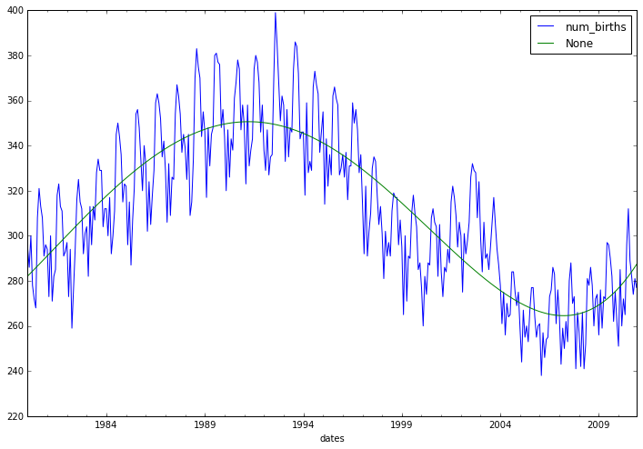


```python
model4.summary()
```


<table class="simpletable">
<caption>OLS Regression Results</caption>
<tr>
  <th>Dep. Variable:</th>            <td>y</td>        <th>  R-squared:         </th> <td>   0.726</td> 
</tr>
<tr>
  <th>Model:</th>                   <td>OLS</td>       <th>  Adj. R-squared:    </th> <td>   0.723</td> 
</tr>
<tr>
  <th>Method:</th>             <td>Least Squares</td>  <th>  F-statistic:       </th> <td>   243.3</td> 
</tr>
<tr>
  <th>Date:</th>             <td>Mon, 23 Jan 2017</td> <th>  Prob (F-statistic):</th> <td>8.01e-102</td>
</tr>
<tr>
  <th>Time:</th>                 <td>22:11:00</td>     <th>  Log-Likelihood:    </th> <td> -1610.7</td> 
</tr>
<tr>
  <th>No. Observations:</th>      <td>   372</td>      <th>  AIC:               </th> <td>   3231.</td> 
</tr>
<tr>
  <th>Df Residuals:</th>          <td>   367</td>      <th>  BIC:               </th> <td>   3251.</td> 
</tr>
<tr>
  <th>Df Model:</th>              <td>     4</td>      <th>                     </th>     <td> </td>    
</tr>
<tr>
  <th>Covariance Type:</th>      <td>nonrobust</td>    <th>                     </th>     <td> </td>    
</tr>
</table>
<table class="simpletable">
<tr>
     <td></td>       <th>coef</th>     <th>std err</th>      <th>t</th>      <th>P>|t|</th> <th>[95.0% Conf. Int.]</th> 
</tr>
<tr>
  <th>const</th>  <td>  282.0876</td> <td>    4.719</td> <td>   59.782</td> <td> 0.000</td> <td>  272.809   291.367</td>
</tr>
<tr>
  <th>time</th>   <td>    0.7359</td> <td>    0.177</td> <td>    4.164</td> <td> 0.000</td> <td>    0.388     1.083</td>
</tr>
<tr>
  <th>time^2</th> <td>    0.0015</td> <td>    0.002</td> <td>    0.781</td> <td> 0.435</td> <td>   -0.002     0.005</td>
</tr>
<tr>
  <th>time^3</th> <td>  -3.2e-05</td> <td> 7.87e-06</td> <td>   -4.068</td> <td> 0.000</td> <td>-4.75e-05 -1.65e-05</td>
</tr>
<tr>
  <th>time^4</th> <td>  6.11e-08</td> <td> 1.05e-08</td> <td>    5.810</td> <td> 0.000</td> <td> 4.04e-08  8.18e-08</td>
</tr>
</table>
<table class="simpletable">
<tr>
  <th>Omnibus:</th>       <td> 3.293</td> <th>  Durbin-Watson:     </th> <td>   0.850</td>
</tr>
<tr>
  <th>Prob(Omnibus):</th> <td> 0.193</td> <th>  Jarque-Bera (JB):  </th> <td>   2.683</td>
</tr>
<tr>
  <th>Skew:</th>          <td> 0.092</td> <th>  Prob(JB):          </th> <td>   0.261</td>
</tr>
<tr>
  <th>Kurtosis:</th>      <td> 2.627</td> <th>  Cond. No.          </th> <td>3.12e+10</td>
</tr>
</table>


```python
df.head()
```


<div>
<table border="1" class="dataframe">
  <thead>
    <tr style="text-align: right;">
      <th></th>
      <th>num_births</th>
      <th>time</th>
      <th>month</th>
      <th>year</th>
      <th>quarters</th>
      <th>time^2</th>
      <th>time^3</th>
      <th>time^4</th>
      <th>time^5</th>
    </tr>
    <tr>
      <th>dates</th>
      <th></th>
      <th></th>
      <th></th>
      <th></th>
      <th></th>
      <th></th>
      <th></th>
      <th></th>
      <th></th>
    </tr>
  </thead>
  <tbody>
    <tr>
      <th>1980-01-31</th>
      <td>295</td>
      <td>0</td>
      <td>1</td>
      <td>1980</td>
      <td>1</td>
      <td>0</td>
      <td>0</td>
      <td>0</td>
      <td>0</td>
    </tr>
    <tr>
      <th>1980-02-29</th>
      <td>286</td>
      <td>1</td>
      <td>2</td>
      <td>1980</td>
      <td>1</td>
      <td>1</td>
      <td>1</td>
      <td>1</td>
      <td>1</td>
    </tr>
    <tr>
      <th>1980-03-31</th>
      <td>300</td>
      <td>2</td>
      <td>3</td>
      <td>1980</td>
      <td>1</td>
      <td>4</td>
      <td>8</td>
      <td>16</td>
      <td>32</td>
    </tr>
    <tr>
      <th>1980-04-30</th>
      <td>278</td>
      <td>3</td>
      <td>4</td>
      <td>1980</td>
      <td>2</td>
      <td>9</td>
      <td>27</td>
      <td>81</td>
      <td>243</td>
    </tr>
    <tr>
      <th>1980-05-31</th>
      <td>272</td>
      <td>4</td>
      <td>5</td>
      <td>1980</td>
      <td>2</td>
      <td>16</td>
      <td>64</td>
      <td>256</td>
      <td>1024</td>
    </tr>
  </tbody>
</table>
</div>


Now that you have fit trend, add in the monthly component via dummy variables to capture seasonality. You could also try to create a 'seasons of the year' variable and fit the quarterly time series instead of the original monthly time you plotted earlier...opportunity to play around.


```python
X = pd.get_dummies(df[['time','time^2','time^3','time^4','month']],
                   columns=['month']).drop('month_1',axis = 1)
```


```python
X.shape
```


    (372, 15)


```python
model_m = sm.OLS(y, sm.add_constant(X)).fit()
bs.plot(figsize=(12,8))
model_m.fittedvalues.plot(label = 'month_dummied')
plt.legend();
```


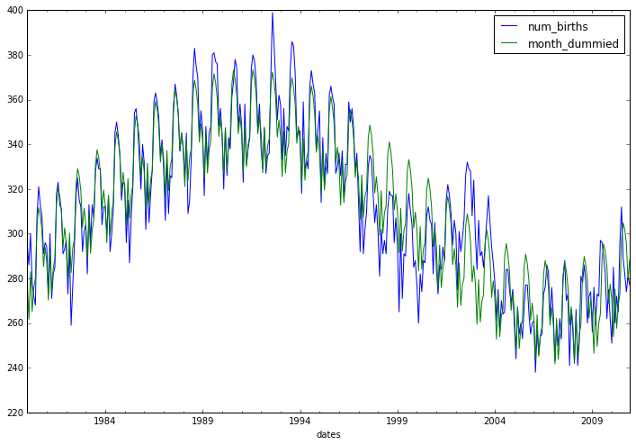


```python
model_m.summary()
```


<table class="simpletable">
<caption>OLS Regression Results</caption>
<tr>
  <th>Dep. Variable:</th>            <td>y</td>        <th>  R-squared:         </th> <td>   0.893</td> 
</tr>
<tr>
  <th>Model:</th>                   <td>OLS</td>       <th>  Adj. R-squared:    </th> <td>   0.888</td> 
</tr>
<tr>
  <th>Method:</th>             <td>Least Squares</td>  <th>  F-statistic:       </th> <td>   197.2</td> 
</tr>
<tr>
  <th>Date:</th>             <td>Mon, 23 Jan 2017</td> <th>  Prob (F-statistic):</th> <td>4.32e-162</td>
</tr>
<tr>
  <th>Time:</th>                 <td>22:11:01</td>     <th>  Log-Likelihood:    </th> <td> -1436.6</td> 
</tr>
<tr>
  <th>No. Observations:</th>      <td>   372</td>      <th>  AIC:               </th> <td>   2905.</td> 
</tr>
<tr>
  <th>Df Residuals:</th>          <td>   356</td>      <th>  BIC:               </th> <td>   2968.</td> 
</tr>
<tr>
  <th>Df Model:</th>              <td>    15</td>      <th>                     </th>     <td> </td>    
</tr>
<tr>
  <th>Covariance Type:</th>      <td>nonrobust</td>    <th>                     </th>     <td> </td>    
</tr>
</table>
<table class="simpletable">
<tr>
      <td></td>        <th>coef</th>     <th>std err</th>      <th>t</th>      <th>P>|t|</th> <th>[95.0% Conf. Int.]</th> 
</tr>
<tr>
  <th>const</th>    <td>  278.7809</td> <td>    3.588</td> <td>   77.695</td> <td> 0.000</td> <td>  271.724   285.838</td>
</tr>
<tr>
  <th>time</th>     <td>    0.6978</td> <td>    0.112</td> <td>    6.206</td> <td> 0.000</td> <td>    0.477     0.919</td>
</tr>
<tr>
  <th>time^2</th>   <td>    0.0018</td> <td>    0.001</td> <td>    1.435</td> <td> 0.152</td> <td>   -0.001     0.004</td>
</tr>
<tr>
  <th>time^3</th>   <td>-3.254e-05</td> <td>    5e-06</td> <td>   -6.505</td> <td> 0.000</td> <td>-4.24e-05 -2.27e-05</td>
</tr>
<tr>
  <th>time^4</th>   <td>  6.13e-08</td> <td> 6.69e-09</td> <td>    9.165</td> <td> 0.000</td> <td> 4.81e-08  7.45e-08</td>
</tr>
<tr>
  <th>month_2</th>  <td>  -17.7778</td> <td>    2.988</td> <td>   -5.950</td> <td> 0.000</td> <td>  -23.654   -11.902</td>
</tr>
<tr>
  <th>month_3</th>  <td>    2.7017</td> <td>    2.988</td> <td>    0.904</td> <td> 0.366</td> <td>   -3.174     8.578</td>
</tr>
<tr>
  <th>month_4</th>  <td>  -15.6583</td> <td>    2.988</td> <td>   -5.240</td> <td> 0.000</td> <td>  -21.535    -9.782</td>
</tr>
<tr>
  <th>month_5</th>  <td>   -5.7612</td> <td>    2.988</td> <td>   -1.928</td> <td> 0.055</td> <td>  -11.638     0.115</td>
</tr>
<tr>
  <th>month_6</th>  <td>   -2.1232</td> <td>    2.988</td> <td>   -0.711</td> <td> 0.478</td> <td>   -8.000     3.754</td>
</tr>
<tr>
  <th>month_7</th>  <td>   21.6105</td> <td>    2.988</td> <td>    7.231</td> <td> 0.000</td> <td>   15.733    27.488</td>
</tr>
<tr>
  <th>month_8</th>  <td>   27.8915</td> <td>    2.989</td> <td>    9.332</td> <td> 0.000</td> <td>   22.014    33.769</td>
</tr>
<tr>
  <th>month_9</th>  <td>   23.7519</td> <td>    2.989</td> <td>    7.946</td> <td> 0.000</td> <td>   17.874    29.630</td>
</tr>
<tr>
  <th>month_10</th> <td>   16.5464</td> <td>    2.989</td> <td>    5.535</td> <td> 0.000</td> <td>   10.668    22.425</td>
</tr>
<tr>
  <th>month_11</th> <td>   -0.6604</td> <td>    2.990</td> <td>   -0.221</td> <td> 0.825</td> <td>   -6.540     5.219</td>
</tr>
<tr>
  <th>month_12</th> <td>    7.1958</td> <td>    2.990</td> <td>    2.407</td> <td> 0.017</td> <td>    1.315    13.076</td>
</tr>
</table>
<table class="simpletable">
<tr>
  <th>Omnibus:</th>       <td> 8.418</td> <th>  Durbin-Watson:     </th> <td>   0.733</td>
</tr>
<tr>
  <th>Prob(Omnibus):</th> <td> 0.015</td> <th>  Jarque-Bera (JB):  </th> <td>   8.343</td>
</tr>
<tr>
  <th>Skew:</th>          <td> 0.334</td> <th>  Prob(JB):          </th> <td>  0.0154</td>
</tr>
<tr>
  <th>Kurtosis:</th>      <td> 3.303</td> <th>  Cond. No.          </th> <td>7.93e+10</td>
</tr>
</table>


Plot the dates variable (x) against the residuals (y) of the final model (including the seasonality term). Is there an obvious pattern of the residuals with respect to time? If there is any autocorrelation left in the model, there will be some pattern in your residual and we'll learn to address that in the afternoon.


```python
df['resid'] = model.resid
```


```python
df.plot(x = 'time', y = 'resid',figsize = (12,8), kind = 'scatter');
```


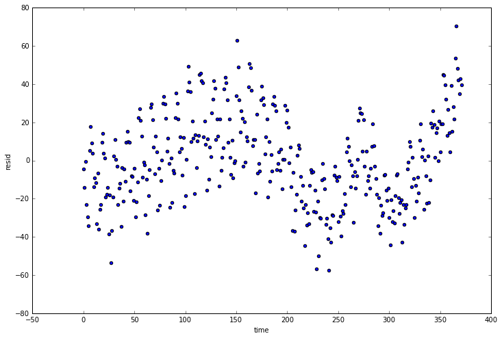


```python
pd.__version__
```


    u'0.19.1'


